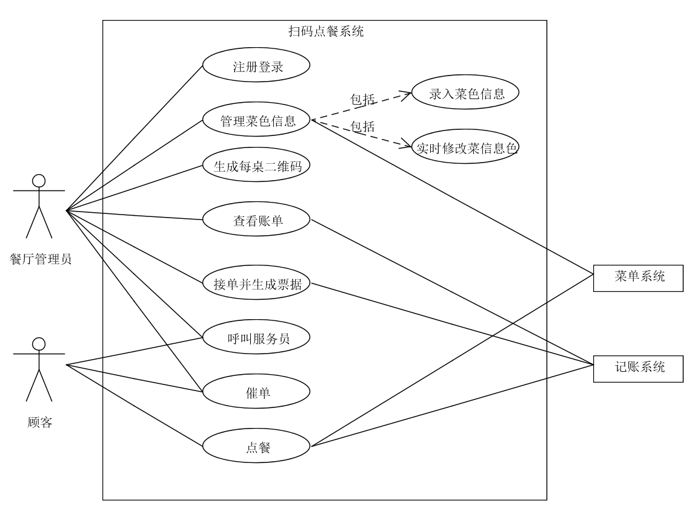

**用例图**

**流程图**
 - 顾客使用流程图
    

 - 商家使用流程图
    

**基本用例：**

 -  注册登录：一个餐厅作为一个店铺用户注册并登录系统。
 -  管理菜色信息：餐厅上传餐厅信息（餐厅简介、广告语）、食品信息（价格、数量、介绍、图片），并允许实时改动菜色信息。
 -  生成每桌二维码：餐厅管理员用系统为每张餐桌生成二维码。
 -  查看账单：查询近期账单（各菜色的销量、收入）。
 -  接单并生成票据：餐厅收到点餐信息（桌号、餐饮类型与数量、备注），以及用户的付款，根据信息打印票据。
 -  点餐：顾客进入餐厅，用手机扫描桌上二维码，系统显示点餐菜单。顾客选择餐饮种类以及数量，添加备注，点击结算、支付。

**扩展用例：**
 - 呼叫服务员：顾客在点餐界面有个呼叫服务员按钮，一按餐厅端的服务员便收到信息（桌号、时间）。
 - 催单：点餐后过了好久都没上菜，顾客可以在点餐界面点击催单按钮，餐厅端收到催单信息（桌号、时间）。

**选做用例：**
 - 多人点单：同一桌的多个顾客同时用手机扫描二维码，系统显示点餐菜单，顾客可以同时点餐，并将点餐数据统一到一份点餐信息上，发送到餐厅端。

- 多人支付：支持AA支付法，每个顾客支付各自的部分。

