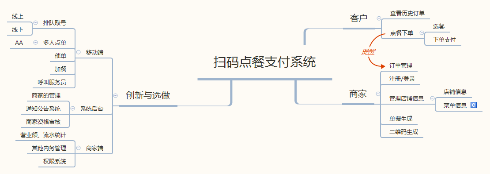
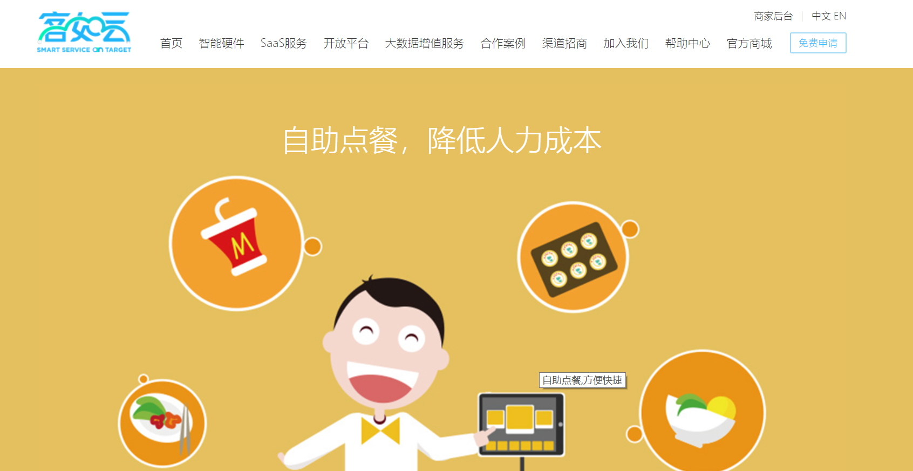
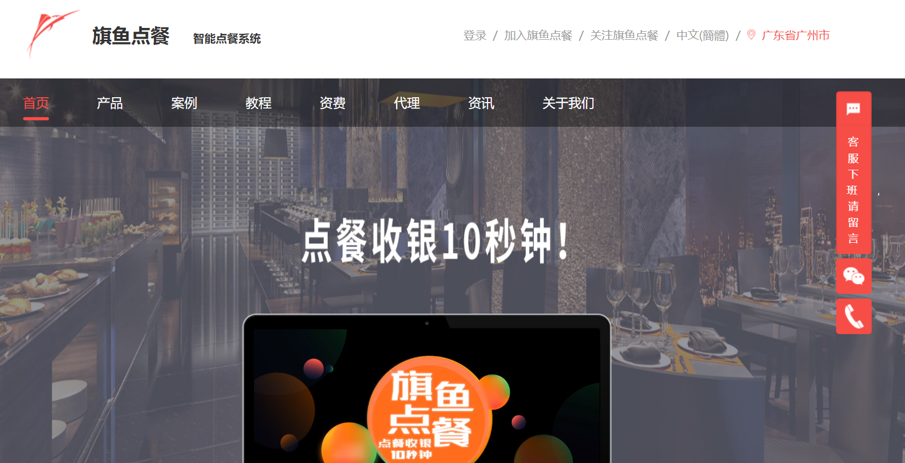
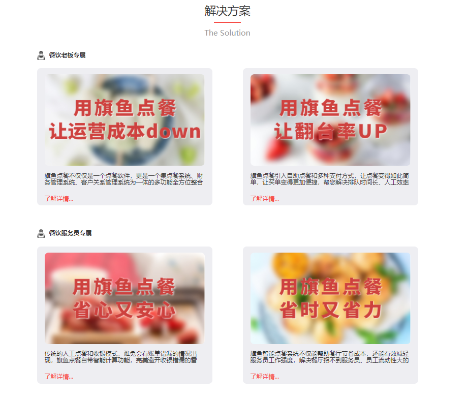
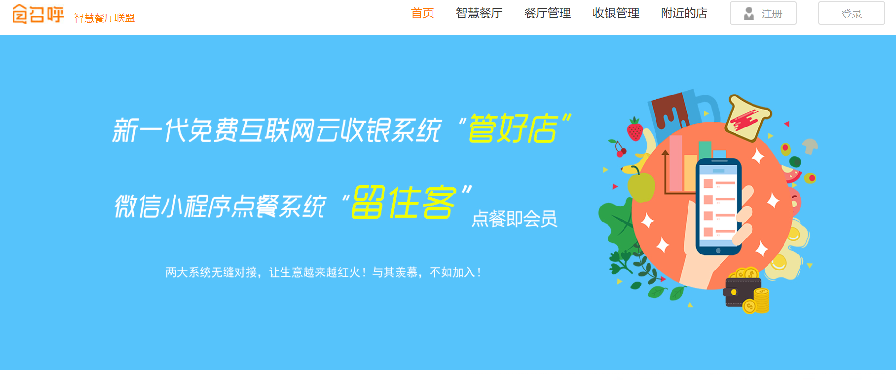
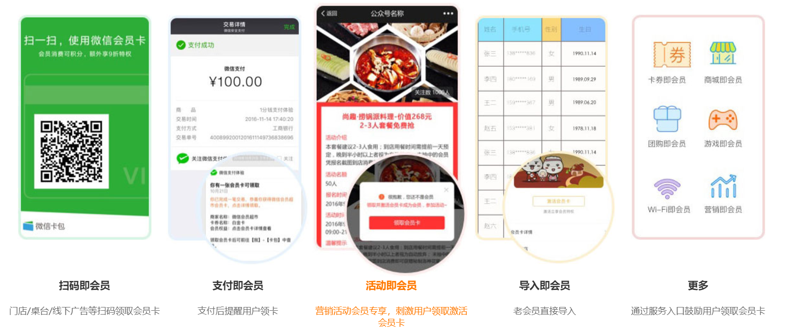
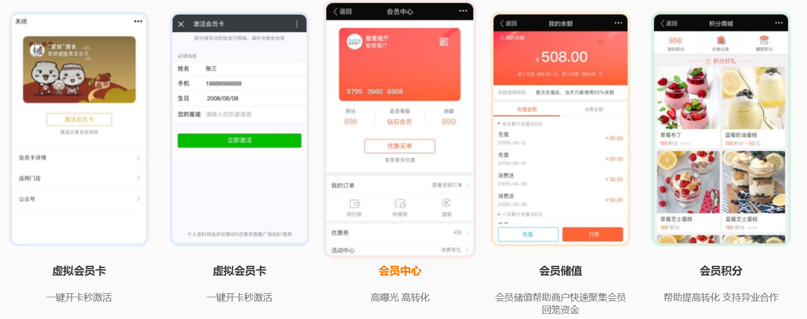

## Baoleme项目策划与愿景陈述

### 一. 项目概要

Baoleme是一个扫码点餐结算系统，我们本着让餐饮企业与顾客双赢的理念，专注于实现顾客自助点餐结算的功能，让整个用餐过程流畅快捷、安全可靠。我们将提供最好的服务和最优的用户体验，在同类产品中独树一帜，脱颖而出。

### 二. 项目背景

##### （一）项目背景

​如今自助下单、线上支付正是热门大势，越来越多的餐饮企业采用这种系统提供服务。自助点餐相比传统的点餐方式更加灵活自由，适用于很多场景。而扫码支付作为非现金支付的一种主要模式，短时间内也无法被刷脸支付取代。因此线上扫码，点餐支付系统真正顺应了潮流的产品和服务形式。

##### （二）项目意义

1. 提升顾客的就餐体验

    优化了顾客用餐过程中几个关键流程，大大减少了顾客用餐时间：首先是排队取号，有些店铺火爆，到店后不一定有座位，线上取号能让顾客提前知道什么时候过去就餐比较合适，而不用花时间苦等；其次是点餐，传统的菜单点餐需要服务员反复确认，但服务员人数不够时顾客就必须等待其他顾客的服务结束；最后是结算，收银员需要根据点餐时生成的菜品单据手动下单结算，录入自己的结算系统，费时费力，而该系统可以实现点餐结算一体化，更加快捷方便。

2. 解决餐饮体系的管理漏洞

    传统模式下餐饮体系存在舞弊、跑单、出错、丢单、效率低等漏洞，例如收银员私扣退菜款、酒水销售在店内赚外快、上菜慢上错菜流失顾客、单据太多财务部门核对工作压力大等等。而我们设计的一体化流程就能避免这些漏洞，给餐饮企业带来更简便的管理模式，减少出错和服务的压力。

##### （三）项目可行性分析

1. 团队实力与技术分析：

  - 在团队实力上，我们有一个认真负责有创意的产品经理，一群技术过硬高效可靠的技术人员，以及一个UI设计外援，有足够的能力实现项目的目标。
  - 而要用到技术，包括小程序开发、MySQL、Koa、RESTful、Redis，可以说都是比较成熟的技术，使用起来风险较低。

2. 市场推广可行性：

  - 传统模式下，中小型企业在顾客流量多的时候会由于服务员人数有限而影响服务的质量和用户的就餐体验，进而影响翻台率，而自助点餐结算系统可以帮助解决传统模式的很多弊端，因此很容易被商家接受和推广；
  - 移动互联网的快速普及下，很多顾客更倾向于线上点餐、线上支付的就餐方式，既节省时间又提高就餐体验，该系统满足大多数顾客的需求，因此便于市场的宣传和推广；

##### （四）项目创新性分析

​	【敲定项目实现的创新功能后，补充......】

### 三. 项目介绍

##### （一）项目概述

​核心业务流程是：顾客就座后扫描餐桌的二维码，查看电子菜单，自助点餐，下单后直接微信支付或其他方式支付，后厨分单制作，服务员送餐至对应桌位，至此顾客完成整个用餐前流程。项目重点在于实现该流程的线上化，提供便捷可靠的服务。

点餐业务流程：

##### （二）项目总体目标

​本产品的用户群体是中小型餐饮企业，以及所有到店用餐的客户。我们的目标是在店家与客户之间搭建一个点餐与支付的平台，为餐厅企业降低经营成本，为顾客提供良好用餐体验。

我们项目团队的另一个重要目标是，在本学期践行面向对象的系统分析与设计方法，体验完整的软件开发流程。

##### （三）平台功能设计

​

##### （四）平台架构设计

​	【敲定项目的架构后整理出流程图，补充......】

### 四. 市场分析

#####  （一）目标市场分析

- 当前市场上大部分餐饮企业仍采用传统的点单点餐流程进行服务，通过调研我们了解到这类企业对于自助点餐结算系统的需求比较大，因此我们的系统能够满足市场的需求，一定程度上提高餐饮企业的营业额；

- 移动互联网时代下，越来越多人青睐于线上完成服务流程比如线上点餐、线上支付，我们的系统能够顺应互联网的潮流，给用户提供友好、优质的就餐体验；

#####  （二）竞争分析

​如今扫码点餐市场充斥着各式各样的软件产品和服务，总的来说良莠不齐，淘宝上也有很多硬件软件服务捆绑售卖。在网上搜索相关词条可以得到很多信息，但这些门户网站上都是王婆卖瓜自卖自夸，能让人方便地立马体验产品的不多。行业内尚未形成一家独大的局面，各自的市场份额也尚未形成公开的统计数据。

下面是一些竞品的网站介绍，[这里是详细的竞品分析](https://github.com/Baoleme/Dashboard/blob/master/documents/competitor_analyze.md)
1. “客如云”系统：

   

2. “旗鱼点餐”：

     

3. “召呼智慧餐厅联盟”系统：

       

### 五. 运营推广

##### （一）商业模式

1. 客户细分:

     主要是中小型餐厅和大多数来店顾客；

2. 价值主张：

   - 中小型餐厅：自助的扫码点餐系统减少使用服务员的流程，节省人力成本；实时更新菜品，海量展示菜品信息；便于宣传餐厅的促销活动，吸引顾客；顾客流量较多时，改善顾客的用餐体验，提高服务质量
   - 来店顾客：全面了解餐厅菜品，节省用餐时间，服务更快被响应

3. 收入来源：

  中小型餐厅购买系统，顾客使用系统；

4. 渠道通路：

      通过与学校附近的小型餐饮店合作推出系统，再根据反馈意见不断迭代完善系统，进一步将系统推广到更广泛的市场中；

5. 核心资源：

   -  相比较于传统的点餐流程，我们的系统实现点餐、结算线上一体化的功能，便于餐厅管理后厨和店面，以及提高顾客的就餐体验；
   - 与现有的扫码点餐系统相比，我们的系统为商家提供了更易于操作的管理平台，以及为顾客设计了更个性化的UI界面和更友好的交互方式，同时也增加不少创新的功能点【待补充......】

6. 关键业务：

    通过前期的市场调研和技术调研，开发出一款满足餐饮企业和顾客基本需求的扫码点餐结算系统，后期再根据进一步的调研和意见反馈，迭代、完善系统的功能；

##### （二） 营销策略

​针对移动互联网的特性，我们提出O2O的营销策略：

1. 通过互联网的渠道宣传，提高系统的知名度，从而吸引线下餐饮企业合作；
2. 更深入和餐饮企业合作，为其定制O2O营销模式，使企业赢利最大化；
