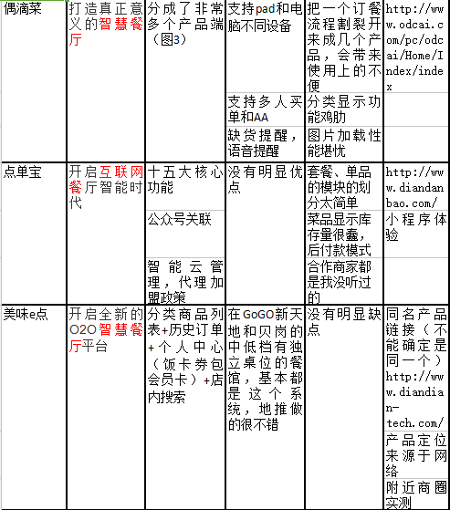
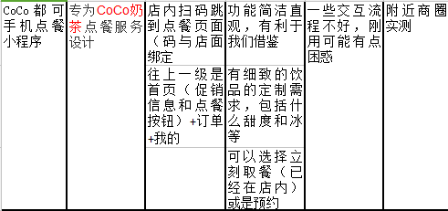
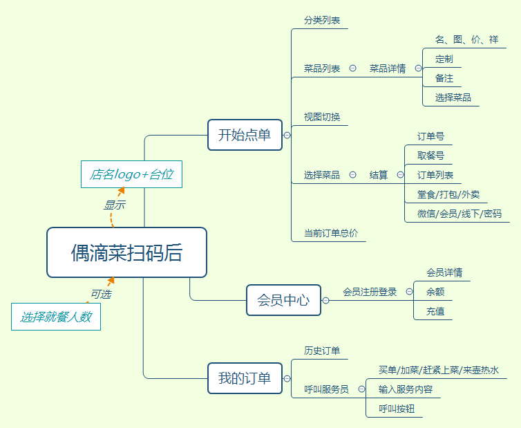
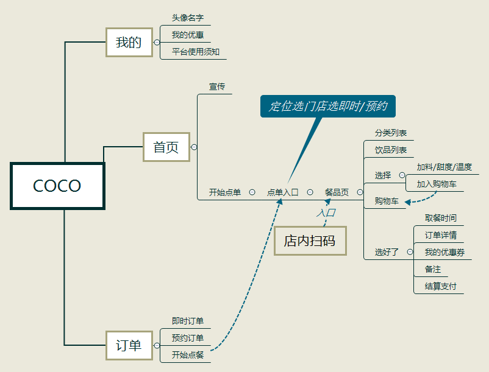
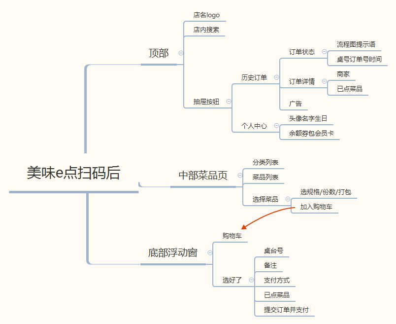
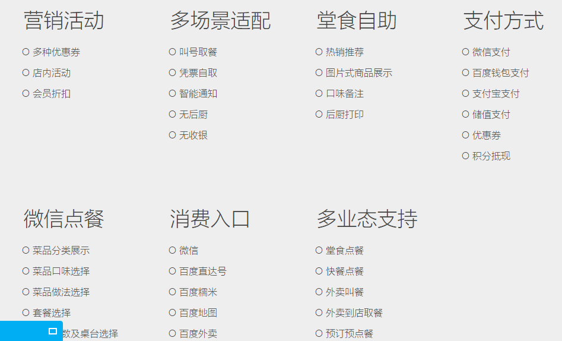

# 扫码点餐支付系统竞品报告

## 背景
扫码点餐支付是当下流行的就餐模式，尚有很多店家没有普及到，可以说餐饮行业是块大蛋糕；而在技术上，微信小程序越来越受人重视，开发成本也并不高——对扫码点餐支付系统来说，机会与挑战并存。

如今扫码点餐市场充斥着各式各样的软件产品和服务，总的来说良莠不齐，淘宝上也有很多硬件软件服务捆绑售卖。在网上搜索相关词条可以得到很多信息，但这些门户网站上都是王婆卖瓜自卖自夸，能让人方便地立马体验产品的不多。行业内尚未形成一家独大的局面，各自的市场份额也尚未形成公开的统计数据。

在这种背景下，我们力所能及地进行了竞品调研，对线上找到的较优秀的产品做了体验和详尽分析，线下也对附近的商圈做了实地的考察，并亲测产品的可用性。

## 竞品列表
*按在搜索结果中出现的频率，从高到低排列：*
<a href="https://github.com/Baoleme/Dashboard/tree/master/documents/xlsx" target="_blank">表格链接</a>

## 交互设计与技术分析
针对扫码点餐的核心业务，我们挑选了偶滴菜、美味e点、CoCo都可手机点餐小程序三款竞品做了详细的交互过程与功能架构设计做了分析。

### 功能框架

分析：
* 堂食/外卖/打包使用场景不明，混杂在最后才做区分导致结算页面臃肿
* 结算时的密码也不知道是啥意思
* 后付款模式没保障
* 选择就餐人数功能鸡肋，就餐人数只有在预定座位时才有必要选择

分析：
* 可以看出使用场景就是到店取餐，分预订和即时两种，没有外卖，因此功能设计算是清晰合理，没有多余的界面和操作环节
* 连锁店模式因此二维码与门店绑定，不提供独立餐桌

分析：
* 订单状态和订单详情部分信息显示有点混乱
* 利用订单页植入游戏广告
* 支付流程清晰明确，模式就是先付款

### 交互体验与视觉风格

*核心流程的页面截图贴在附录*

**偶滴菜：**
* demo比较粗糙，尤其是餐品的列表整个图放在上面，很丑
* 风格简约，白色与橙色为主色调，界面框架的圆角，传递友好亲近的感觉
* 账单总详情页、注册会员弹框的设计不够美观
* 支付模式看不透，可以堂食下单，呼叫服务员那里也有买单选项
* 无法返回主页

**CoCo：**
* 白橙色调同品牌logo
* 架构清晰合理，交互上也比较符合用户习惯
* 定位选门店那里的设计可能不太好，灰色的地方不确定是否可以点击

**美味e点：**
* 红色和橙色主色调，背景白，还能看到蓝色按钮，好像配色有点杂，整体感觉一般
* 架构清晰合理，交互上也比较符合用户习惯
* 从抽屉按钮进入的是底部三分导航（点餐、历史订单、个人中心）的页面，而不是一开始扫码就有这个三分导航，这个设计非常友好，也就是说我关注于点餐的时候不会看到多余的信息
* 另一种看法：首页由右上角的按钮跳转到“历史记录”和“个人中心”，不够显眼，顾客很可能忽视此功能
* 个人中心模块有点丑

### 亮点特点借鉴

**偶滴菜:**
* 客户端多语言（法英中）切换、多种付款模式、餐品页多种视图
* 后厨端可操作顾客台位所点订单，多种智能排序，具备出菜、退菜管理
* 支持一人买单、AA买单、多人买单
* 时间提醒，催菜功能——尚不清楚
* 后台管理大数据，帮助餐馆管理员管理餐厅的销售报表、走势图、顾客反馈，以及大数据分析——尚不清楚

**CoCo：**
* 顾客可以根据不同场景选择门店和取餐时间
* 连锁店管理
* 不定期的赠送优惠券活动会刺激消费

**美味e点：**
* 店内搜索功能
* 首页的菜品图片较真实、有吸引力
* 饭卡功能刺激消费，更便于结算支付
* 下单后的小游戏推荐帮助顾客消遣时间，减少因等待就餐时间长而心情不适的次数
* 订单状态分下单成功-》厨房接单-》用餐结束，历史订单列表中有个印戳显示每个订单状态

## 总结
竞品们客户端的功能架构上基本上都是分订单、我的、点餐三大模块，其中我的可以做很多拓展和修改，像会员权益和活动的宣传推广等。

在商圈实地考察的结果是：在GoGO新天地和贝岗的中低档有独立桌位的餐馆，基本上被美味e点承包了，除此之外就是奶茶店的线上点餐系统做的比较多比较新，像CoCo的小程序就是2017年12月份上线的。而对于线上调研的结果，找到的竞品每一家都有行业领跑者的架势，出了客如云是专注于门店的，其他都把目标用户定位整个餐饮企业。它们把应用场景覆盖得很全面，基本上可以想到的需求都有人申明我在做，各种大数据和运营方案都有——只不过都没亲自体验不敢说好不好用。对我们来说，不需要花太多的功夫挖掘需求和想创新点，能想到的别人都有，把核心流程做好用要紧。关于拓展的功能，这份竞品分析，在更远以后的迭代可以重新拿出来作为参考，深入挖掘。

另外一个消息是，美团今年一月份也升级上线了扫码点餐功能，支持多人点餐，这个我们还没有试用过，毕竟美团的重心业务还是外卖，想来交互流程上不会差距太多。但个人认为，美团作为巨头加入扫码点餐的市场，其他软件的生存状况应该不会太乐观。点餐软件在前期推广过程需要地推，需要很多人力成本，而美团先天就有着巨大的商家用户基数，这对其他竞争者，尤其是之后的创业者都是及其不利的。

## 附录

图1：

图2：

 

图3：

偶滴菜页面截图：
（选择就餐人数） -> 扫码进入首页 -> 餐品页 -> 菜品详情

  

-> 选餐下单 -> 订单支付

  

CoCo页面截图：
（主界面 -> 定位店铺 -> ）餐品页

 

-> 下单支付

美味e点页面截图：
餐品页 -> 下单 -> 支付

  
