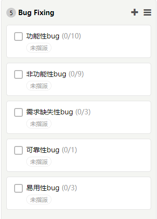

# 综合测试报告

| 项目名称 | 测试时间 | 测试员 |
| -------- | -------- | ------ |
| Baoleme | 2018.7.5 | zhoumumu |
| Baoleme | 2018.7.7 | Crystal 、  Li Xiaoyun |

## 1 引言
### 1.1编写目的

- 通过对测试结果的分析，得到对软件质量的评价
- 分析测试的过程，产品，资源，信息，为以制定测试计划提供参考（虽然不会有下一次了）
- 评估测试执行和测试计划是否符合
- 分析系统存在的缺陷，为修复和预防bug提供建议

### 1.2项目背景
本产品是一个扫码点餐系统，包含小程客户端和web商家端。本产品以扫码点餐结算业务为核心，商家端支持必要的管理功能，让顾客轻松点餐，商家省心省力。

### 1.3参考资料

- Baoleme Project Proposal
- UseCase Overview
- UseCase Documents
- Back End Test Report
- Backlog

## 2 测试概要
### 2.1测试用例设计
#### 2.1.1功能性
[用例详细说明](../UseCases/README.md)

- 主要用例：客户端点餐、商家端订单管理、商家端菜品管理
- 次要用例：客户端查看历史订单、商家端注册登录、商家端生成二维码

#### 2.1.2易用性

- 操作按钮提示信息正确性，一致性，可理解性
- 限制条件提示信息正确性，一致性，可理解性
- 必填项标识
- 输入方式可理解性
- 中文界面下数据语言与界面语言的一致性

### 2.2测试环境与配置
#### 2.2.1功能测试
 - 测试服务器配置：反向代理服务器地址https://baoleme.andiedie.cn
 - 商端设备：Chrome + Win10
 - 小程序设备：iOS & Android

#### 2.2.2性能测试
 - 测试服务器配置：反向代理服务器地址https://baoleme.andiedie.cn，后端服务器地址 http://api.baoleme.andiedie.cn
 - 测试工具：JMeter
 - 测试设备：Win10
 - 测试环境：Java8.0，jdk1.8.0

### 2.3测试方法和工具
本次测试用例设计主要采用黑盒测试方法。其中单元测试由开发人员直接完成；功能模块及集成测试采用的是非渐增式测试，重点在模块间接口和数据提取。具体方法有等价类划分、边界值划分、正交分解、因果图分析和错误猜测；在系统测试时依据业务流程采用回归测试，重点在于业务流程。性能测试使用常见的工具JMeter，先配置测试参数后录制测试脚本，再根据生成的聚合报告分析系统的性能。

## 3 测试内容和执行情况
| 模块 | 用例数 | 用例通过个数 | 问题数 |
| ---- | ------ | ------------ | ------ |
### 3.1功能
#### 3.1.1客户端点餐
前提：已经进入小程序（客户端用户登录）

| 功能 | 基本要求 | 测试情况 | 通过(Y/N) |
| ---- | -------- | -------- | --------- |
| 查看菜单 | 准备一张商家二维码，小程序内扫码出现商家信息和菜单信息。可以滚动查看菜单，点击菜品显示详情页。 | 已实现 | Y |
| 选餐 | 一、可以直接加减选择菜品，有规格的菜品弹出浮窗选择规格，确认后添加到购物篮，购物篮累计价格。二、不可选择售罄菜品。三、查看购物篮中菜品，加减份数可以正确显示。四、更改规格购物篮中计价发生改变 | 发现没有售罄的设计 | N |
| 下单 | 选好两样菜品，去下单跳到确认订单页，添加备注，检查桌号和菜品信息是否相符。一、返回修改菜单信息之后再确认也能得到正确显示。二、确认下单后出现mock的支付成功页面。确认后看到订单正在进行的状态页。在商端验证收到的新订单 | 已实现 | Y |

#### 3.1.2订单管理
| 功能 | 基本要求 | 测试情况 | 通过(Y/N) |
| ---- | -------- | -------- | --------- |
| 显示与查看 | 正在进行中的订单按时间先后排列，点开订单可以查看详细信息 | 等待时间计数不正确 | N |
| 操作 | 一到四、接单，拒绝，完成，取消，四种操作在客户端能看到对应的状态，在对应的筛选tab下可以看到 | 不正常能接单，进而发现小程序端不能正常支付等 | N |
| 查询 | 输入任意字符串，模糊匹配到相关订单 | 已实现 | Y |

#### 3.1.3菜品管理
本模块测试要求所做修改动作在商端和客户端都能看到。

| 功能 | 基本要求 | 测试情况 | 通过(Y/N) |
| ---- | -------- | -------- | --------- |
| 菜品基本信息管理 | 一、新建一个菜品。二、图、名、描述、状态、标签、售卖状态的增删改。三、删除一个菜品。四、使用筛选框搜索菜品 | 已实现 | Y |
| 分类管理 | 一到四、CRUD。五、修改一个菜品的所属分类。 | 已实现 | Y |
| 价格管理 |（菜品卡片上始终显示最低价）一、修改基础价格。二、增删改规格。三、增删改规格子选项 | 已实现 | Y |
| 快速编辑模式 | 一、拖动排序。二、修改菜品基本信息 | 拖动排序没做 | N |
| 基本排序 | 拖动卡片排序 | 理解错了需求做了分类排序没做这个 | N |

#### 3.1.4注册登录
| 功能 | 基本要求 | 测试情况 | 通过(Y/N) |
| ---- | -------- | -------- | --------- |
| 注册 | 输入必要信息，经过邮箱验证激活账号，产生一个可登录账户 | 已实现 | Y |
| 登录 | 输入正确的账号和密码，能够成功登陆看到商家首页，获得商家信息 | 已实现 | Y |
| 退出登录 | 能正常退出，并保证登出前的操作得到保存。再次登陆，验证之前收接订单、修改账户信息的操作是否生效 | 已实现 | Y |

#### 3.1.5其他附加功能
| 功能 | 基本要求 | 测试情况 | 通过(Y/N) |
| ---- | -------- | -------- | --------- |
| 客户端查看历史订单 |（客户端用户登录）点击订单的tab，展示出历史订单 | 空空的 | N |
| 商端首页 |（商端用户登录）一、增减订单和完成订单，订单统计数目正确。二、统计板块跳转正常 | 计数不符合需求 | N |
| 生成二维码 | 输入桌数，生成对应张数的二维码，且能够正常扫描使用看到对应桌号 | 会拿到所有生成过的二维码，而不是这一次 | N |
| 商端用户信息修改 | 点名、电话、介绍、Logo修改后回到首页显示修改结果 | 已实现 | Y |

### 3.2性能
*注：测试系统在预定环境和负载下的响应速度、通信效率、设备效率、执行效率。

性能测试主要分为后端性能测试以及网页性能测试，其中一部分的网页性能测试包括后端性能测试。

#### 3.2.1测试内容

- 测试用例

| 用例名称 | 基本要求 | 并发数 | 是否通过 |
|-------|-------|-------| --- |
| 商家端登录 | 商家同时登录 | 100 | Y |
| 客户端登录 | 多个小程序客户同时登录 | 100 | Y |
| 查询订单 |商家同时查询订单，且订单的各项参数合法|100| Y|
| 新增菜品 |商家同时新增菜品，且菜品各项参数合法|100|Y|
| 获取菜品页面 |商家同时获取菜品| 100 |Y|
| 获取二维码 | 多个商家同时获取二维码列表 | 100 |Y|
| 点餐 | 同时点餐 | 100 |Y|

- 测试接口

| 网页名称 | 并发数 |
| --- | --- |
| 注册页 | 100 |
| 登录页 | 100 |
| 首页 | 100 |
| 搜索订单页 | 100 |
| 正在处理中订单页 | 100 |
| 已结束订单页 | 100 |
| 全部订单页 | 100 |
| 全部订单页 | 100 |
| 菜品管理页 | 100 |
| 新建/编辑菜品页 | 100 |
| 生成二维码页 | 100 |
| 商家信息页 | 100 |
| 商家更改密码页 | 100 |

#### 3.2.2参数设置
| 参数名| 值|
| ---- | --- |
| 脚本循环次数 | 无限 |
| 并发用户数 | 100 |
| 真实客户端数量 | 1 |
| 脚本录制方法 | 自动 |
| 模拟路线类型 | 10/100M以太网 |

#### 3.2.3性能测试结果

##### Jmeter参数解释

- Label：JMeter的每个HTTP Request的name属性值
- Samples：请求数，表示本次测试一共发出了多少个请求
- Average：单个HTTP Request的平均响应时间
- Median：50%用户的响应时间
- 90% Line：90%用户的响应时间
- 95% Line：95%用户的响应时间
- 99% Line：99%用户的响应时间
- Min：最小响应时间
- Max：最大响应时间
- Error%：错误率，即错误请求数 / 请求总数
- Throughtput：吞吐量，每秒完成的请求数
- Received KB/Sec：每秒从服务器端接收到的数据量
- Sent KB/Sec：每秒发送到服务器端的数据量

##### Jmeter测试结果

 - 后端性能测试
1. 并发数量为100时，商家端部分API（包括商家登录、获取菜品、查询订单、获取二维码、添加菜品）的测试报告：

2. 并发数量为200时，商家端部分API（包括商家登录、获取菜品、查询订单、获取二维码、添加菜品）的测试报告：

3. 并发数量为200时，顾客端部分API（包括顾客登录、下单）的测试报告：

 - 网页性能测试

1. 并发数量为200时，各个网页接口的测试报告：

#### 3.2.4性能测试结果分析
 - 后端性能测试分析

根据Jmeter聚合报告的结果可以看出，各后端api表现正常，在跑100个线程（用户）时，平均时间为9.862s，错误率在低并发(5-100)的情况下为0%，在样本数为160-170左右时错误率会开始指数性增加，原因是新建过多菜品导致每次需要读取很多数据，这会限制数据库对其他请求的响应，这时候服务器就会开始崩溃，无法响应其他请求，在测试过程中，我们大约等待20分钟，服务器才恢复正常。考虑到现实情况中我们的技术面向是小型商家，性能测试的结果是符合预期的。

 - 网页性能测试分析

根据JMeter聚合报告的截图显示，当系统的并发数量达到200且各个页面的访问数量接近在450左右时，Error率接近于0，即能够正常访问网页；当各个页面的访问数量开始从460增加到500，Error率会明显上升，响应时间也明显增加，而每秒完成的请求数会降低，说明页面访问数量460左右是一个瓶颈，服务器性能逐渐降低并出现错误。

#### 3.2.5执行效率
平均响应时间(s)：

| 并发用户数 | 商家端登录 | 客户端登录 | 查询订单 | 新建菜品 | 获取菜品 | 获取二维码 | 下单 |
| --- | --- | --- | --- | --- | --- | --- | --- |
| 5 | 0.195 | 0.258 | 0.421 | 0.033|1.218 |0.109 | 0.071 |
| 10 |0.294 | 0.213 | 0.293 |0.057 | 0.976|0.168 | 0.063 |
| 50 | 2.502| 1.400 |1.501 |2.714 |15.218 | 1.028 |1.347 |
| 100 |5.228 | 3.775 |6.841 |1.812 |32.207  |3.224| 7.985 |

### 可靠性
突然断网
非法输入
[商端]工具栏刷新退出
### 安全性
### 易用性
编辑提示，增删改时的必填项，输入规范等。
[商端&后台]邮件点击激活之后未跳到主页面
[商端]查询的时候“没有符合条件的订单”这句提示会在查询过程中短暂出现，最好是查不到再出现
[商端]网络断开之后再连上，原本已登录的界面不变但功能失效，没有“重新登陆”的提示
### 兼容性
### 安装和手册

## 4 覆盖分析

## 5 缺陷的统计与分析
### 5.1缺陷汇总
缺陷总数：26

具体缺陷内容见tower

### 5.2Bug引入阶段

## 测试结论与建议
### 测试结论
### 建议

***未竟之事***
同时编写安装和手册
修改测试方法与工具
小程序端取消订单功能？倒是可以圆过去：用户取消订单发生在商家接单之前，这一点在堂食场景下发生的频率不高（就算是外卖的也不高），而假如是突然有事没办法继续在这吃饭了，也可以找来服务员，让商家先接单后取消。
用例设计输入输出字段
性能测试要写入用例设计中吗？
后端测试报告最好补上时间、版本，覆盖分析
交互效果与设计的一致性检查
bug是否改完

参考：
https://wenku.baidu.com/view/c54b0611cc7931b765ce1537.html
https://wenku.baidu.com/view/5852795d3b3567ec102d8a1f.html
